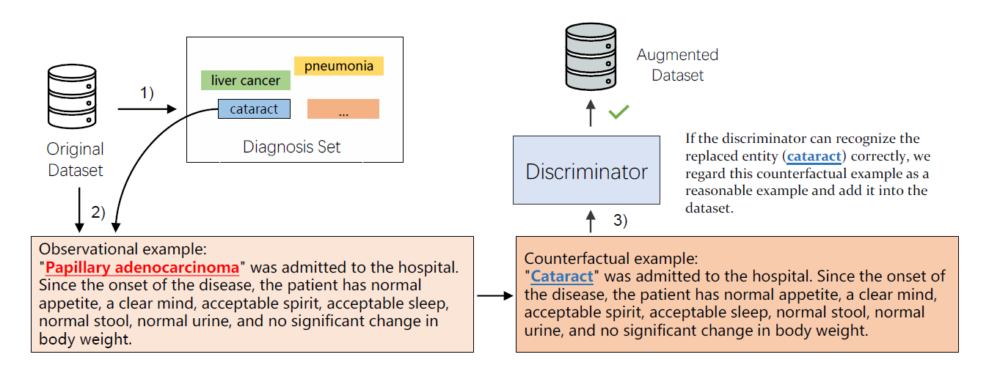

Implementation of the paper "[Counterfactual Generator: A Weakly-Supervised Method for Named Entity Recognition](#)".

# **C**ounter**F**actual **GEN**erator (`cfgen`)
## Introduction


We propose the Counterfactual Generator, which generates counterfactual examples by the interventions on the existing observational examples to enhance the original dataset by breaking the entangled correlations between the spurious features and the non-spurious fearures. Experiments across three datasets show that our method improves the generalization ability of models under limited observational examples.

## Getting Started
### Setup Environment
- [`Python3`](https://www.python.org/)
- [`Ubuntu 18.04`](https://ubuntu.com/download/desktop)

```bash
sudo apt install python3-pip
pip3 install virtualenv
virtualenv -p /usr/bin/python3 env
source env/bin/activate
pip install -r requirements.txt
```

### Quick Start
It is important to know that we do not provide the link or data of the dataset `IDiag`, because it is a private dataset only for the *INTERNAL USE*.

- Train a model on a given dataset

    ```bash
    python app.py train --gpu "[0, 1]" --model "bilstm" --dataset "cluener" --seed 100
    ```

- Training with all settings

    ```bash
    python app.py trainall --gpu "[0, 1]" --models "['bilstm', 'bert']" --datasets "['cluener', 'cner']"
    ```

## Citation
```plain
@inproceedings{zeng-etal-2020-cfgen,
    title = "Counterfactual Generator: A Weakly-Supervised Method for Named Entity Recognition",
    author = "Xiangji Zeng and Yunliang Li and Yuchen Zhai and Yin Zhang",
    year = "2020"
    publisher = "Association for Computational Linguistics"
}
```

## License
CFGen is CC-BY-NC 4.0.

## Contact
If you have any questions, please contact Xiangji Zeng <zengxiangji@zju.edu.cn> or create a Github issue.
